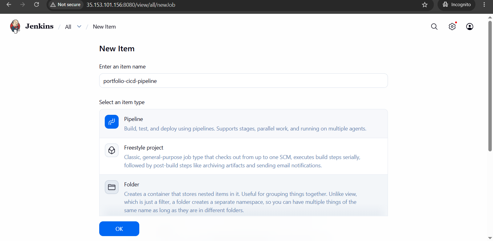
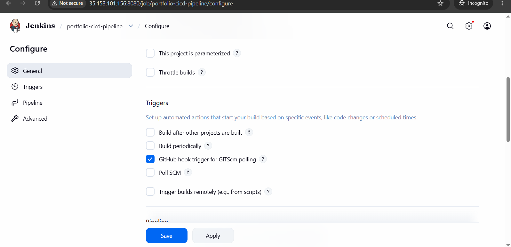
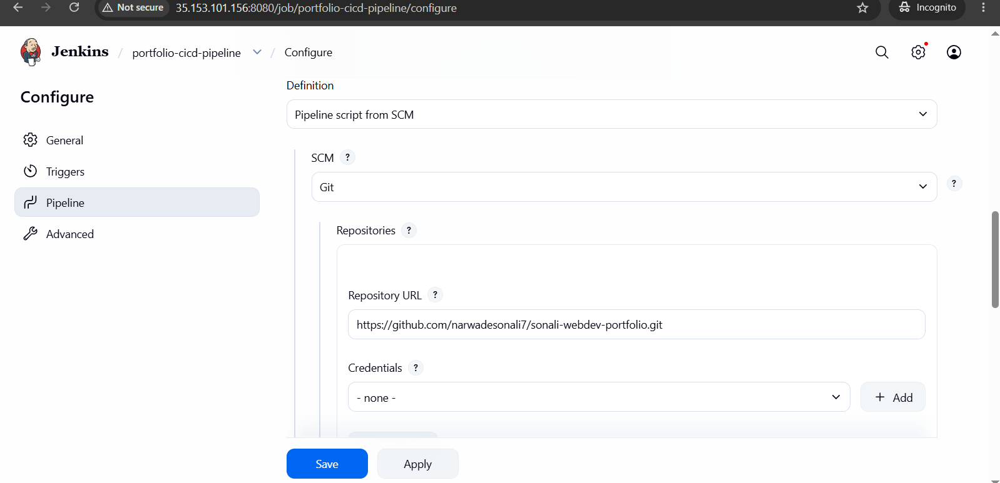
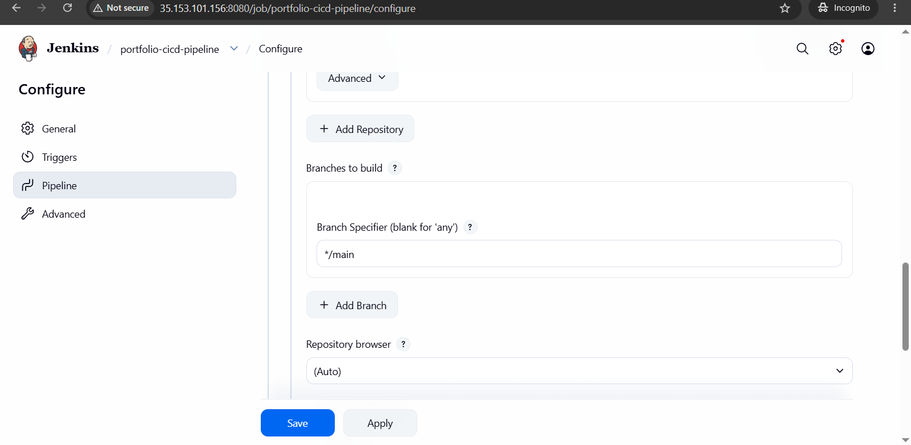
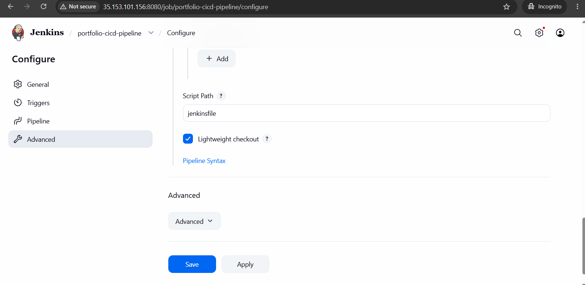
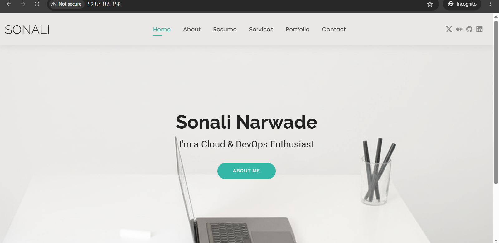

# Portfolio Application Deployment using Jenkins CI/CD Pipeline

## Project Overview

This project demonstrates the complete CI/CD deployment of a static portfolio website using Jenkins Pipeline. The Jenkins server automatically fetches the latest code from GitHub, connects to the Apache web server using SSH credentials, and deploys the updated website files.

The automation is triggered using GitHub Webhooks, allowing every new code push to start the deployment process without manual intervention.

---

# Architecture

```
Developer
    |
    | Git Push
    ↓
GitHub Repository
    |
    | Webhook Trigger
    ↓
Jenkins Server
    |
    | Jenkins Pipeline + SSH Agent
    ↓
Apache Web Server (EC2)
    |
    ↓
Portfolio Website Live
```

---

# Prerequisites

Before starting the deployment, make sure you have:

* AWS EC2 instance for Jenkins server
* AWS EC2 instance for Apache web server
* GitHub repository containing portfolio source code
* Jenkins installed and running
* Java installed on Jenkins server
* SSH key pair for secure communication between Jenkins and Apache server

---

# Step 1: Install Required Jenkins Plugins

Login to Jenkins Dashboard.

Navigate to:

```
Manage Jenkins
        ↓
Plugins
        ↓
Available Plugins
```

Install the following plugins:

## 1. SSH Agent Plugin

Purpose:

* Allows Jenkins to securely connect to another server using SSH credentials.
* It loads the private SSH key during pipeline execution.

After installation:

* Restart the Jenkins server.

---

## 2. Pipeline Plugin

Purpose:

* Allows us to write deployment automation using Jenkinsfile.
* Supports CI/CD workflows.

After installation:

* Restart Jenkins.

---

## 3. GitHub Plugin

Purpose:

* Integrates Jenkins with GitHub.
* Enables webhook-based automatic pipeline triggering.

After installation:

* Restart Jenkins.

---

# Step 2: Configure Jenkins Credentials

Jenkins requires the private SSH key of the Apache server to perform deployment.

Navigate to:

```
Manage Jenkins
        ↓
Credentials
        ↓
System
        ↓
Global Credentials
        ↓
Add Credentials
```

Configure the credential as follows:

| Field       | Value                                               |
| ----------- | --------------------------------------------------- |
| Kind        | SSH Username with private key                       |
| ID          | node-app-key-deploy                                 |
| Description | node-app-key-deploy                                 |
| Username    | ubuntu                                              |
| Private Key | Enter directly and paste the EC2 `.pem` private key |

Click **Create** to save the credential.

---

# Step 3: Configure Apache Web Server

Login to the portfolio EC2 server using SSH:

```bash
ssh -i your-key.pem ubuntu@your-server-ip
```

Update package information:

```bash
sudo apt update
```

Install Apache2:

```bash
sudo apt install apache2 -y
```

Start Apache service:

```bash
sudo systemctl start apache2
```

Enable Apache to start automatically after server reboot:

```bash
sudo systemctl enable apache2
```

Verify Apache status:

```bash
sudo systemctl status apache2
```

Change ownership of the web directory:

```bash
sudo chown -R ubuntu:ubuntu /var/www/html/
```

---

# Step 4: Create Jenkins Pipeline Job

Open Jenkins Dashboard.

Click:

```
New Item
```

Enter the job name:

```
portfolio-cicd-pipeline
```

Select:



```
Pipeline
```

Click **OK**.

---

# Step 5: Configure Pipeline from SCM

In the pipeline job configuration:

### General Section

Enable:

```
GitHub hook trigger for GITScm polling
```


---

### Pipeline Section

Select:

```
Definition: Pipeline script from SCM
```

Configure:

```
SCM: Git
```

Enter the GitHub repository URL.

Example:

```
https://github.com/username/portfolio-project.git
```


Branch:

```
*/main
```


Script Path:

```


Jenkinsfile
```

Click:

```
Save
```

---

# Step 6: Jenkinsfile Deployment Workflow

The Jenkins pipeline performs the following tasks:

1. Jenkins automatically checks out the latest source code from GitHub.
2. Jenkins connects to the Apache server using SSH Agent credentials.
3. Existing website files in `/var/www/html` are removed.
4. New portfolio files are copied to the EC2 server.
5. Files are deployed into Apache's web root directory.
6. Apache serves the latest version of the website.

---

# Step 7: Configure GitHub Webhook

Open your GitHub repository.

Navigate to:

```
Repository
      ↓
Settings
      ↓
Webhooks
      ↓
Add Webhook
```

Configure the webhook:

### Payload URL

```
http://JENKINS_PUBLIC_IP:8080/github-webhook/
```

Example:

```
http://54.157.207.240:8080/github-webhook/
```

### Content Type

```
application/json
```

### Events

Select:

```
Just the push event
```

Click:

```
Add Webhook
```

---

# Step 8: Test CI/CD Pipeline

Make changes in the portfolio project.

Commit the changes:

```bash
git add .
git commit -m "Updated portfolio website"
git push origin main
```

After pushing:

* GitHub sends a webhook request to Jenkins.
* Jenkins automatically starts the pipeline.
* The latest website files are deployed to the Apache EC2 server.

---

# Verification

Check Jenkins build status:

```
Dashboard
      ↓
portfolio-cicd-pipeline
      ↓
Build History
```

A successful build displays a green status.

Access your website:

```
http://52.87.185.158/
```

---

# CI/CD Workflow Summary

```
Code Change
    |
    ↓
Git Push
    |
    ↓
GitHub Webhook
    |
    ↓
Jenkins Pipeline Trigger
    |
    ↓
SSH Authentication
    |
    ↓
Connect to Apache EC2
    |
    ↓
Remove Old Website Files
    |
    ↓
Copy New Website Files
    |
    ↓
Deploy to /var/www/html
    |
    ↓
Portfolio Website Updated
```

---

# Technologies Used

* AWS EC2
* Linux (Ubuntu)
* Jenkins
* Jenkins Pipeline
* Git
* GitHub
* GitHub Webhooks
* Apache2 Web Server
* SSH
* Shell Scripting

---

# Conclusion

This project implements a complete CI/CD pipeline for a static portfolio application. By integrating GitHub Webhooks with Jenkins Pipeline, every code change is automatically built and deployed to the Apache server, reducing manual effort and ensuring faster, reliable deployments.
